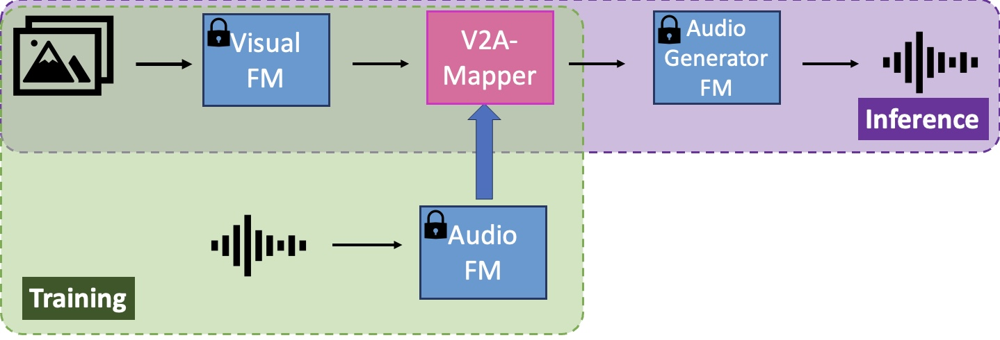
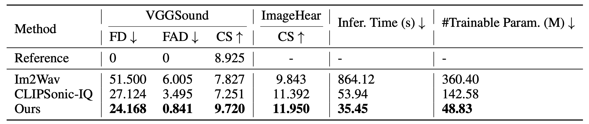

# V2A-Mapper: A Lightweight Solution for Vision-to-Audio Generation by Connecting Foundation Models

For benchmarking purpose, this repo hosts the generated test samples of "V2A-Mapper: A Lightweight Solution for Vision-to-Audio Generation by Connecting Foundation Models" ([[arXiv]](https://arxiv.org/abs/2308.09300) [[project]](https://v2a-mapper.github.io/))

Authors: [Heng Wang](https://scholar.google.com.au/citations?user=jPj4ViQAAAAJ&hl=en), [Jianbo Ma](https://scholar.google.com/citations?user=1CSIbMsAAAAJ&hl=fr), [Santiago Pascual](https://scholar.google.com/citations?user=7cVOyh0AAAAJ&hl=ca), Richard Cartwright, and [Weidong Cai](https://www.sydney.edu.au/engineering/about/our-people/academic-staff/tom-cai.html) from [University of Sydney](https://www.sydney.edu.au/) and [Dolby Laboratories](https://www.dolby.com/).


## Main Results
Compared to previous methods [Im2Wav](https://arxiv.org/abs/2211.03089) and [CLIPSonic](https://arxiv.org/abs/2306.09635), our V2A-Mapper is trained with 86% fewer parameters but can achieve 53% and 19% improvement in Frechet Distance (FD, fidelity) and Clip-Score (CS, relevance), respectively.


## VGGSound
[VGGSound](https://github.com/hche11/VGGSound) contains 199,176 10-second video clips extracted
from videos uploaded to YouTube with audio-visual correspondence. Following the original train/test split, we evaluate the performance on 15,446 test samples. Our generated test samples (~5G) for VGGSound can be downloaded from [here](https://drive.google.com/drive/folders/18Iw7xv96J5pKP3tlgwPd8hI5nMHFDQsS?usp=sharing).

## ImageHear
To testify the generalization ability of our V2A-Mapper, we also test on out-of-distribution dataset [ImageHear](https://github.com/RoySheffer/im2wav/tree/main/Data/ImageHear) which contains
101 images from 30 visual classes (2-8 images per class). Our generated test samples (~33M) for ImageHear can be downloaded from [here](https://drive.google.com/drive/folders/1Ee8FLdtjgQV1CHP8Aee1FNwCWZVr25Y2?usp=sharing).

## Custom Datasets
If you need sample results by V2A-Mapper for your own datasets, we are happy to generate that for you. Please send the request to [heng.wang@sydney.edu.au](heng.wang@sydney.edu.au) and [jianbo.ma@dolby.com](jianbo.ma@dolby.com).
## Citation
If you find our work helpful in your research, please kindly cite our paper via:
```bibtex
@article{v2a-mapper,
  author    = {Wang, Heng and Ma, Jianbo and Pascual, Santiago and Cartwright, Richard and Cai, Weidong},
  title     = {V2A-Mapper: A Lightweight Solution for Vision-to-Audio Generation by Connecting Foundation Models},
  journal   = {arXiv preprint arXiv:2308.09300},
  year      = {2023},
}
```

## Contact
If you have any questions or suggestions about this repo, please feel free to contact me! ([heng.wang@sydney.edu.au](heng.wang@sydney.edu.au))